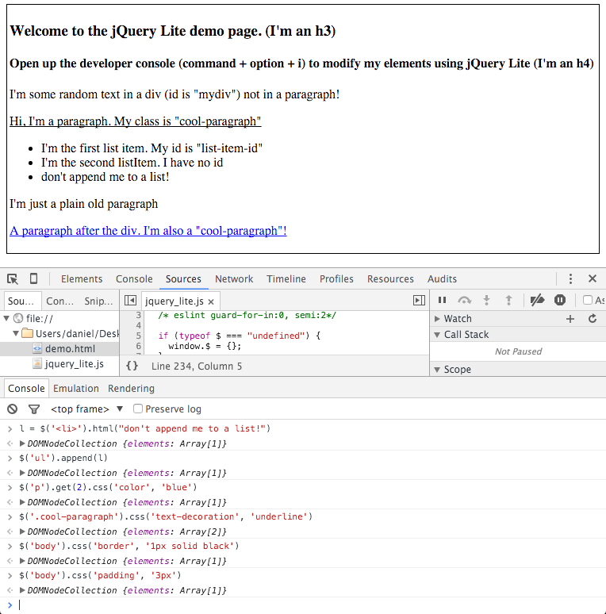

# jQuery Lite

jQuery Lite is a recreation of the essential functionality of the popular JavaScript library [jQuery](https://jquery.com/). It supports some of jQuery's most important features including:

* DOM Manipulation and Traversal
* Event Handling
* Ajax

jQuery Lite was written using the DOM manipulation classes from plain JavaScript.

# Set up

1. [Download the file](https://raw.githubusercontent.com/deager/jquery-lite/master/jquery_lite.js) into your working directory.
2. Require it in a script tag at the top of your HTML file like so ``

# Demo-ing

1. [Download the repository](https://github.com/deager/jquery-lite/archive/master.zip).
2. Open `demo.html`
3. Open the developer console to play around with DOM elements

or

Write your own script using jQuery-Lite!

# Methods

Here is the list of most commonly used jQuery API functions:

* **[html()](http://api.jquery.com/html)**: Gets or sets an inner HTML of an element
* **[find()](http://api.jquery.com/find)**: Selects elements based on the provided selector string
* **[append()](http://api.jquery.com/append)** Injects an element into the DOM after the selected element
* **[hide()](http://api.jquery.com/hide)**: Hides an element if it was visible
* **[show()](http://api.jquery.com/show)**: Shows an element if it was hidden
* **[css()](http://api.jquery.com/css)**: Gets or sets the style attribute value of an element
* **[attr()](http://api.jquery.com/attr)** Gets or sets any attribute of an element
* **[val()](http://api.jquery.com/val)**: Gets or sets the value attribute of an element
* **[text()](http://api.jquery.com/text)**: Gets the combined text of an element and its children
* **[on()](http://api.jquery.com/on)**: Attaches an event listener to an element
* **[off()](http://api.jquery.com/off)** Detaches an event listener from an element
* **[each()](http://api.jquery.com/each)**: Iterates over a set of matched elements
* **[$.extend()](http://api.jquery.com/jQuery.extend)**: Merge the contents of two or more objects together into the first object
* **[$.ajax()](http://api.jquery.com/jQuery.)**: Perform an asynchronous HTTP (Ajax) request
* **[$.get()](http://api.jquery.com/jQuery.)**: Load data from the server using a HTTP GET request
* **[$.post()](http://api.jquery.com/jQuery.)**: Load data from the server using a HTTP POST request